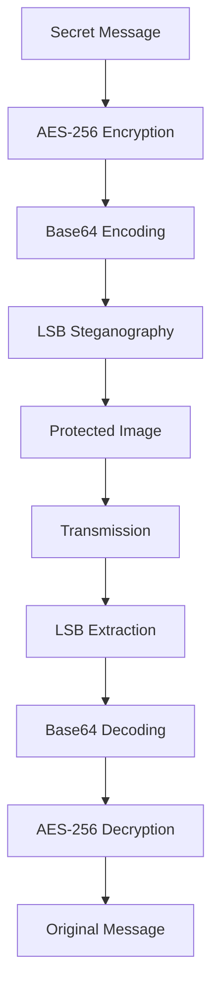

# Secure Image Steganography with AES Encryption 🔒

[](https://www.python.org/)
[](https://streamlit.io/)
[](https://opencv.org/)

A secure data hiding system that combines AES-256 encryption with LSB steganography to protect sensitive information during transmission.


## Features ✨

- **Military-grade Encryption** 🔐
  - AES-256-CBC with PBKDF2 key derivation
  - Secure password hashing with 100,000 iterations
  - Random salt and IV generation

- **Advanced Steganography** 🖼️
  - LSB (Least Significant Bit) embedding
  - Automatic capacity calculation
  - Header-based length encoding
  - Multi-image format support (PNG, JPG, JPEG)

- **User-friendly Interface** 💻
  - Streamlit-based web UI
  - Drag-and-drop functionality
  - Real-time feedback
  - Cross-platform compatibility

## Installation ⚙️

1. Clone the repository:
```bash
git clone https://github.com/x0lg0n/AICTE-INTERNSHIP-PROJETC.git
cd AICTE-INTERNSHIP-PROJECT
```
## Install dependencies:

```bash
pip install -r requirements.txt
```

## Usage 🚀
Start the application:

```bash
streamlit run app.py
```

## Encoding Process:

- Upload cover image

- Enter secret message

- Set encryption password

- Download protected image

## Encoding Demo


## Decoding Process:

- Upload protected image

- Enter decryption password

- View extracted message

## Decoding Demo


## Technical Architecture 🧠

## 🔧 Key Components  

| **Component**       | **Technology Used**   | **Purpose**                    |
|---------------------|-----------------------|--------------------------------|
| 🔐 **Encryption**   | AES-256-CBC           | Data confidentiality           |
| 🔑 **Key Derivation** | PBKDF2-HMAC-SHA256   | Secure password hashing        |
| 🖼️ **Steganography** | LSB Embedding         | Data concealment               |
| 🎨 **Image Processing** | OpenCV             | Pixel manipulation             |
| 🛠️ **UI Framework**   | Streamlit            | User interface                 |


## Contributors 👥

- **[Siddhartha Kunwar](https://github.com/x0lg0n)**   

## License 📄
This project is licensed under the MIT License - see the [LICENSE](LICENSE) file for details.

## Acknowledgments 🙏

- Cryptographic functions powered by `pycryptodome`

- Image processing handled by `OpenCV`

- UI components from `Streamlit`
